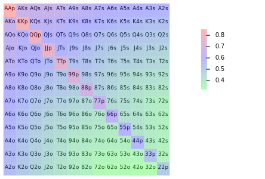
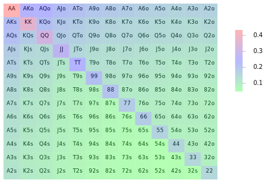
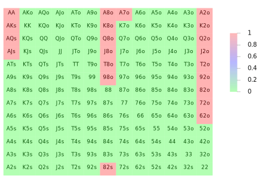
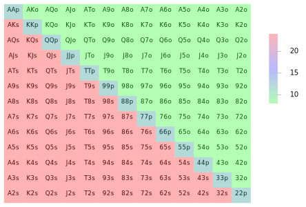
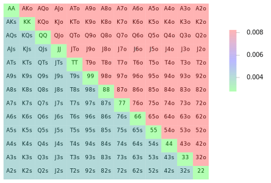
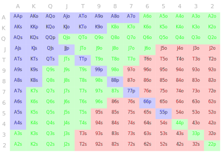

poker-fold
===

A Haskell poker library exploring:

- speed
- static analysis
- deception

Heads-up odds versus any2

Odds versus full table

Tier shifts between heads-up and full table.

top 10% range:

miscellaneous
---

